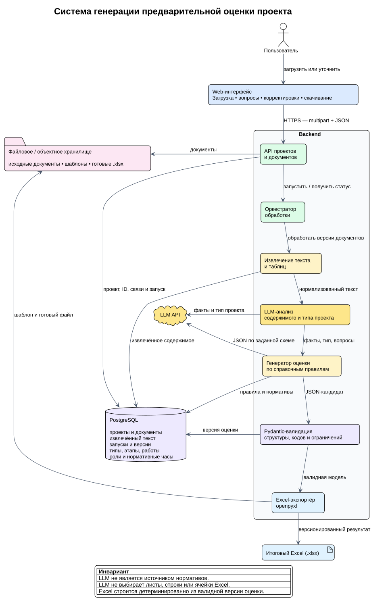

# Архитектура генерации предварительной оценки проекта

Документ описывает целевую систему, в которой пользователь загружает проектные документы, а приложение анализирует их, определяет тип проекта, формирует этапы и работы по корпоративным нормативам и выдаёт проверенный Excel-файл.



Подробный обмен между компонентами показан на [схеме сценария](project-flow.svg).

## Архитектурные артефакты

- `project-architecture.puml` — исходник компонентной схемы PlantUML.
- `project-architecture.svg` и `project-architecture.png` — компонентная схема для документации.
- `project-flow.puml` — исходник основного пользовательского сценария.
- `project-flow.svg` и `project-flow.png` — отрисованный сценарий.
- `project-architecture.drawio` — редактируемая компонентная схема для diagrams.net.

PlantUML-файлы являются каноническими: при изменении архитектуры сначала обновляются они, затем изображения и версия draw.io.

## Результат работы системы

Система должна сформировать версионируемую предварительную оценку проекта:

- определённый тип проекта и зафиксированные допущения;
- этапы проекта в правильном порядке;
- работы внутри этапов;
- роли исполнителей и нормативные часы;
- предупреждения о неполных или противоречивых данных;
- Excel-файл, построенный из проверенной версии расчёта.

## Основной сценарий

1. Пользователь создаёт проект и загружает документы через веб-интерфейс.
2. Frontend отправляет файлы в backend одним `multipart/form-data` запросом либо несколькими запросами в рамках одного `projectId`.
3. Backend сохраняет в PostgreSQL проект, идентификаторы документов, их привязку к проекту и запись запуска обработки. Бинарные файлы сохраняются в файловом или объектном хранилище; в PostgreSQL остаются метаданные и ссылка на объект.
4. Модуль обработки документов извлекает текст и таблицы из поддерживаемых форматов. Результат привязывается к версии документа, чтобы повторный запуск не обрабатывал неизменённые файлы заново.
5. LLM анализирует содержимое, выделяет требования, ограничения и признаки типа проекта.
6. Если данных недостаточно или они противоречат друг другу, запуск получает статус `requires_input`. Пользователь видит вопросы, исправляет сведения или добавляет файлы, после чего создаётся новый запуск.
7. После определения типа проекта backend получает из справочника правила построения этапов, допустимые виды работ, роли и нормативы часов.
8. LLM формирует черновик оценки только в согласованной JSON-схеме. Справочные коды и правила передаются ей как контекст; LLM не является источником нормативов.
9. Pydantic валидирует структуру, обязательные поля, коды справочников и числовые ограничения. Невалидный ответ не попадает в расчёт и Excel.
10. Валидная модель сохраняется как новая версия оценки. Excel-экспортёр по стабильным кодам переносит данные на нужные листы и строки шаблона с помощью `openpyxl`.
11. Пользователь скачивает Excel, проверяет результат и при необходимости запускает новую итерацию. Предыдущие версии не перезаписываются.

## Компоненты и ответственность

| Компонент | Ответственность | Не должен делать |
|---|---|---|
| Web-интерфейс | Загрузка файлов, показ статуса, вопросов и предупреждений, запуск повторной обработки, скачивание результата | Самостоятельно рассчитывать часы или собирать итоговый Excel |
| Backend API | Авторизация, проекты и документы, запуск и статус обработки, выдача результатов | Доверять структуре ответа LLM без валидации |
| Оркестратор обработки | Последовательность шагов, повторные попытки, идемпотентность, переходы статусов | Хранить состояние только в памяти процесса |
| Обработчик документов | Получение файла, извлечение текста и таблиц, нормализация, диагностика неподдерживаемого содержимого | Определять этапы и нормативы проекта |
| LLM-анализ | Извлечение фактов, определение типа проекта, формирование кандидата оценки | Назначать несуществующие справочные коды или определять координаты Excel |
| Справочник проектов | Типы проектов, правила этапов, виды работ, роли и нормативные часы | Зависеть от формулировок конкретного промпта |
| Pydantic-валидация | Проверка контракта, кодов, ограничений и полноты результата | Молча исправлять смысловые ошибки модели |
| Excel-экспортёр | Детерминированное отображение валидной модели в версионируемый шаблон | Вызывать LLM или рассчитывать данные из произвольного текста |
| PostgreSQL | Проекты, документы и связи, извлечённый текст, запуски, версии оценок, справочники и метаданные экспорта | Использоваться как неограниченное хранилище больших бинарных файлов без отдельного решения |
| Файловое/объектное хранилище | Исходные документы, шаблоны и сформированные `.xlsx` | Содержать единственную копию бизнес-состояния проекта |

Функциональные компоненты можно развернуть в одном backend-приложении для MVP. Вынос обработчика документов или LLM-оркестратора в отдельные workers является решением по нагрузке, а не изменением контрактов.

## Доменная модель результата

LLM возвращает кандидата, соответствующего модели такого уровня:

```text
ProjectEstimate
├── project_type_code
├── summary
├── assumptions[]
├── warnings[]
└── stages[]
    ├── stage_code
    ├── name
    ├── order
    └── works[]
        ├── work_type_code
        ├── description
        ├── role_code
        ├── hours
        └── source_document_ids[]
```

`project_type_code`, `stage_code`, `work_type_code` и `role_code` должны существовать в справочниках. Для объяснимости каждая существенная работа по возможности содержит ссылки на документы-источники. Финальные часы принимаются только после применения серверных правил и ограничений.

## Минимальные сущности PostgreSQL

| Сущность | Назначение |
|---|---|
| `projects` | Проект, владелец и текущая версия оценки |
| `documents` | Метаданные файла, хэш, URI хранилища и версия |
| `project_documents` | Привязка документов к проектам |
| `document_extractions` | Извлечённый текст, таблицы, версия обработчика и ошибки |
| `processing_runs` | Запуск конвейера, статус, шаг, ошибки и связь с входными версиями |
| `project_types` | Справочник типов проектов |
| `stage_rules` | Правила и порядок этапов для типа проекта |
| `work_type_norms` | Виды работ, роли и нормативные часы |
| `estimate_versions` | Валидированная JSON-модель, допущения и предупреждения |
| `generated_files` | Версия шаблона, URI и контрольная сумма готового Excel |

## Состояния запуска

```text
uploaded
  → extracting
  → analyzing
  → requires_input ──→ analyzing
  → generating
  → validating
  → exporting
  → ready
```

Из любого рабочего состояния возможен переход в `failed` с сохранением шага, технической причины и безопасного сообщения для пользователя. Повтор должен продолжать идемпотентный шаг либо создавать новый запуск с явной ссылкой на предыдущий.

## Предлагаемый API MVP

| Метод и путь | Назначение |
|---|---|
| `POST /api/v1/projects` | Создать проект |
| `POST /api/v1/projects/{projectId}/documents` | Загрузить и привязать документы |
| `POST /api/v1/projects/{projectId}/runs` | Запустить или повторить генерацию оценки |
| `GET /api/v1/projects/{projectId}/runs/{runId}` | Получить шаг, прогресс, вопросы и ошибки |
| `GET /api/v1/projects/{projectId}/estimates/{version}` | Получить валидированную версию оценки |
| `GET /api/v1/projects/{projectId}/exports/{version}.xlsx` | Скачать Excel для выбранной версии |

Долгая обработка не должна удерживать исходный HTTP-запрос. Команда запуска возвращает `202 Accepted` и `runId`; frontend получает статус опросом или через SSE/WebSocket.

## Инварианты

- Каждый документ и результат обработки принадлежат конкретному проекту и версии запуска.
- Изменение файлов, пользовательских поправок, справочников или шаблона создаёт новую версию результата.
- Повтор одного запроса с тем же ключом идемпотентности не создаёт дублирующий запуск.
- Текст из документов считается недоверенным вводом: он не может переопределять системный промпт, правила справочника или команды backend.
- Только валидированная доменная модель может быть сохранена как оценка и передана Excel-экспортёру.
- Excel строится детерминированно из сохранённой версии; повторный экспорт той же версии и шаблона даёт эквивалентный результат.
- Все обращения к LLM, версии промптов, моделей, справочников и шаблонов фиксируются для воспроизводимости.

## Решения, которые нужно зафиксировать до реализации

1. Конкретное файловое/объектное хранилище и срок хранения исходных документов.
2. Поддерживаемые форматы и ограничения по размеру, количеству страниц и архивам.
3. Конкретный LLM API, лимиты, политика повторов и синхронный либо фоновый режим workers.
4. Правила определения типа проекта и порог уверенности, после которого требуется подтверждение пользователя.
5. Владелец и процесс версионирования справочников нормативов и Excel-шаблона.
6. Какие пользовательские изменения разрешены в интерфейсе до повторной генерации.
7. Требования к удалению документов, аудиту, обезличиванию и разграничению доступа.
