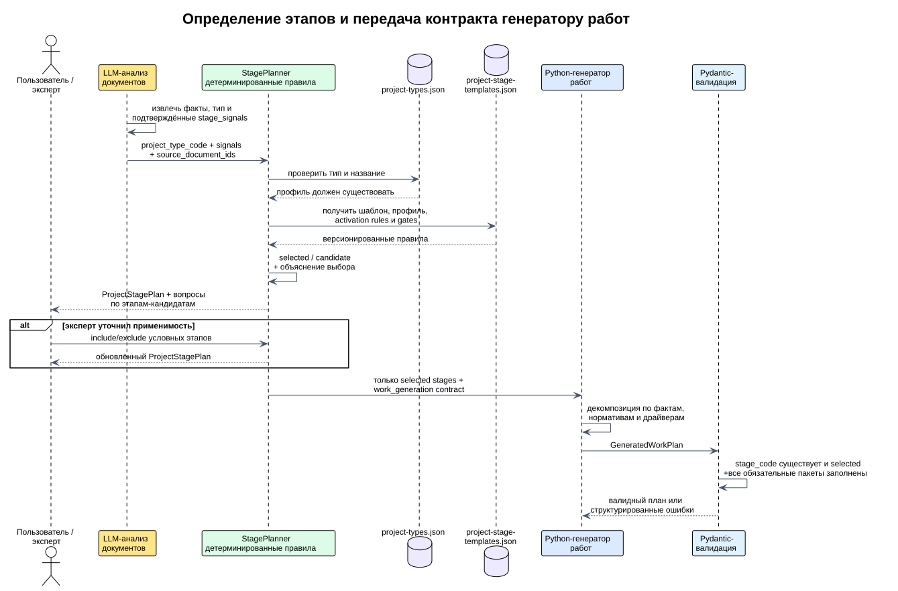

# Методика определения этапов проектов MONS

## Результат

Система превращает код типа проекта и подтверждённые признаки конкретного запроса в
версионируемый `ProjectStagePlan`. Результат содержит:

- стабильный `stage_code`, порядок, цель и статус `selected`/`candidate`;
- входные критерии, ожидаемые результаты и gate выхода;
- объяснение, почему этап выбран или требует подтверждения;
- входы, категории и драйверы для декомпозиции работ;
- разделение последовательных, параллельных и регулярных этапов.

Канонический справочник —
[`data/project-stage-templates.json`](../data/project-stage-templates.json), Pydantic-контракт —
[`app/stage_contracts.py`](../app/stage_contracts.py), resolver —
[`app/stage_planner.py`](../app/stage_planner.py).



## Почему не один шаблон и не 26 копий

В локальных примерах обнаруживаются разные устойчивые жизненные циклы:

- корпоративная почта: проектирование, подготовка среды, пилот, массовая миграция,
  ПМИ и передача в эксплуатацию;
- аудит: сбор информации, AS-IS, оценка, рекомендации и отчёт;
- поддержка: проектирование сервиса, приём, готовность, регулярные операции,
  отчётность и улучшение;
- поставка: спецификация, квотация, заказ, доставка, возможная ПНР и приёмка;
- облачная услуга: сайзинг, предложение, заказ, provisioning, onboarding,
  регулярное потребление и продление.

Поэтому используются восемь семейств жизненного цикла и отдельный профиль каждого из
26 кодов. Профиль задаёт специализацию, сигналы по умолчанию и подсказки генератору работ.
Resolver всегда разворачивает профиль в полный план: потребитель не наследует JSON вручную.

## Методические основания

Методика адаптирует практики, а не копирует терминологию одного стандарта:

1. Этап заканчивается крупным проверяемым результатом. PMI определяет phase как набор
   логически связанных действий, обычно завершающийся крупным deliverable, а WBS — как
   deliverable-oriented decomposition. Поэтому работы находятся уровнем ниже этапов.
2. У этапа есть entry criteria, deliverables и exit gate. Переход к реализации нельзя
   обосновать одним ключевым словом.
3. Облачная миграция использует assess/prepare/migrate, волны, зависимости, pilot и
   rollback, что согласуется с AWS MAP и Microsoft Cloud Adoption Framework.
4. ИБ учитывает prepare/select or design/implement/assess/authorize/monitor из NIST RMF.
   Для коммерческих проектов отдельное согласование ИБ условно, а испытания обязательны.
5. Поддержка отделяет service transition от регулярной эксплуатации и улучшения. Разовые
   переходные работы не смешиваются с месячным сервисом.

Первичные источники:

- MONS: https://mons.ru/company/
- PMI, Practice Standard for Scheduling:
  https://www.pmi.org/-/media/pmi/documents/public/pdf/certifications/practice-standard-scheduling.pdf
- PMI, Work Breakdown Structures:
  https://www.pmi.org/learning/library/practice-standard-work-breakdown-structures-8063
- AWS Migration Acceleration Program:
  https://aws.amazon.com/migration-acceleration-program/
- Microsoft Cloud Adoption Framework:
  https://learn.microsoft.com/en-us/azure/cloud-adoption-framework/
- NIST Risk Management Framework:
  https://csrc.nist.gov/Projects/risk-management/about-rmf

MONS описывает полный цикл от стратегического ИТ-консалтинга и внедрения до постоянной
поддержки и развития, а также инфраструктуру, ИБ, облака и поставки. Это соответствует
выделенным семействам и исходному каталогу.

## Правила определения

### Тип выбирает профиль

`project_type_code` обязан существовать в `data/project-types.json`. На старте проверяется
точное покрытие: отсутствующий профиль, лишний код, неизвестный шаблон/сигнал или override
несуществующего этапа останавливают загрузку.

### Сигналы активируют условные этапы

Примеры: `migration`, `pilot`, `data_transfer`, `hardware_delivery`, `subcontractor`,
`security_approval`, `training`, `renewal`.

- `always` → этап всегда `selected`;
- `if_any` → выбран при любом подтверждённом сигнале;
- `if_all` → выбран при всех указанных сигналах;
- без подтверждения этап остаётся `candidate` с предупреждением.

Отсутствие сигнала не означает запрет. Так неполное ТЗ не теряет пилот, ПНР или обучение.
Эксперт может явно включить/исключить условный этап. Обязательный этап исключить нельзя.

### ИИ извлекает факты, resolver применяет правила

LLM возвращает только допустимые сигналы с основанием и `source_document_ids`. Порядок,
обязательность, gates и контракт работ LLM не придумывает. `AnalysisWorker` передаёт
сигналы в `StagePlanner` и сохраняет полный `stage_plan` в `raw_result` анализа.

### Параллельные и регулярные этапы

`execution_mode=parallel` означает, что управление идёт одновременно с delivery.
`execution_mode=recurring` — повторяемый пакет за месяц или иной период. Генератор сроков
не должен суммировать их как последовательные фазы.

## Покрытие типов

| Тип | Семейство | Специализация |
|---|---|---|
| `SUP_Complex` | complex | комплексная ИТ-поддержка |
| `SUP_L1` | managed_support | Service Desk / L1 |
| `SUP_L2` | managed_support | рабочие места и выезды |
| `SUP_L3_HW` | managed_support | L3 с аппаратной поддержкой |
| `SUP_L3_SW` | managed_support | L3 программной инфраструктуры |
| `SUP_SUPPLIER` | managed_support | сервис с подрядчиками |
| `SUP_IT_Audit` | audit | аудит инфраструктуры и процессов |
| `SUP_IT_Consulting` | consulting_design | архитектура и регламенты |
| `SUP_IT_Implementation` | implementation | инфраструктурное внедрение |
| `SUP_Cloud_Consulting` | consulting_design | облако и migration roadmap |
| `SUP_Cloud_IaaS` | cloud_service | IaaS |
| `SUP_Cloud_PaaS` | cloud_service | PaaS |
| `SUP_Cloud_SaaS` | cloud_service | собственный SaaS |
| `SUP_Cloud_Subscription` | cloud_service | подписка вендора |
| `SUP_App_Support` | managed_support | поддержка приложений |
| `SUP_IT_office` | implementation | миграция офисного пакета |
| `SUP_import_sub_infra` | implementation | импортозамещение |
| `SUP_HW` | supply | оборудование |
| `SUP_SW` | supply | ПО |
| `SUP_Leasing` | leasing | аренда оборудования |
| `SEC_Audit` | audit | аудит ИБ |
| `SEC_Support` | managed_support | поддержка средств защиты |
| `SEC_Implementation` | implementation | внедрение системы ИБ |
| `SEC_HW` | supply | оборудование ИБ |
| `SEC_SW` | supply | лицензии ИБ |
| `SEC_Complex` | complex | комплексный проект ИБ |

## Python

```python
from pathlib import Path

from app.stage_contracts import StagePlanContext
from app.stage_planner import StagePlanner

planner = StagePlanner.from_files(
    Path("data/project-types.json"),
    Path("data/project-stage-templates.json"),
)
plan = planner.build_plan(
    "SUP_IT_Implementation",
    StagePlanContext(signals=["migration", "data_transfer", "pilot", "training"]),
)
selected_stages = [stage for stage in plan.stages if stage.status == "selected"]
```

Для интерактивной корректировки служат `include_stage_codes` и `exclude_stage_codes`.
Чтобы передать генератору только подтверждённое, задайте `include_candidates=False`.

## API и CLI

```http
POST /api/v1/project-types/SUP_IT_Implementation/stage-plan
Content-Type: application/json

{
  "signals": ["migration", "data_transfer", "pilot"],
  "include_stage_codes": [],
  "exclude_stage_codes": [],
  "include_candidates": true
}
```

```powershell
python -m app.stages_cli validate
python -m app.stages_cli plan SUP_IT_Implementation `
  --signal migration --signal data_transfer --signal pilot
python -m app.stages_cli plan SUP_HW --only-selected
```

## Версионирование

- `schema_version` меняется при несовместимом изменении JSON-контракта.
- `methodology_version` — при смысловом изменении этапов, gates или правил выбора.
- Коды этапов не переименовываются ради редакторской правки: это внешний контракт для
  работ, Excel и истории расчётов.
- Новый тип обязан сразу получить профиль, иначе приложение не стартует.
- Удаление обязательного этапа требует новой версии методики и миграционного решения.

